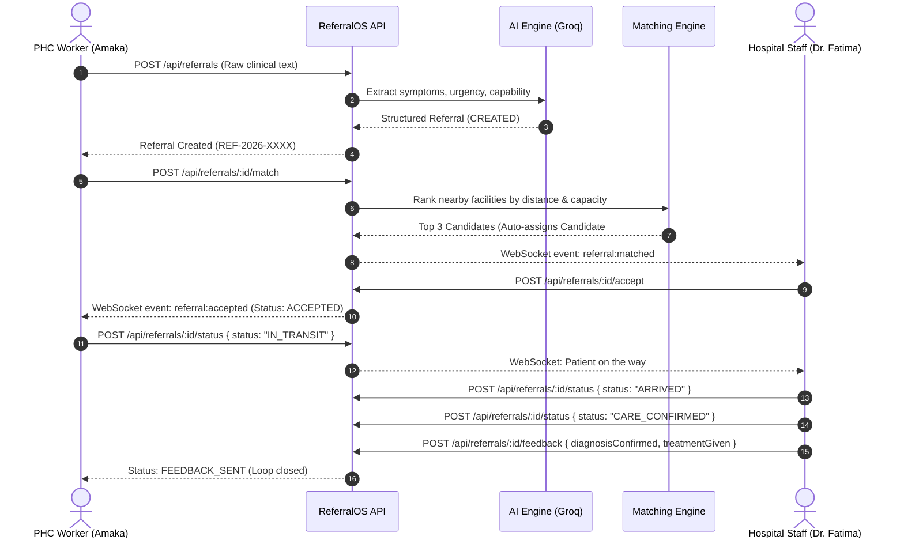
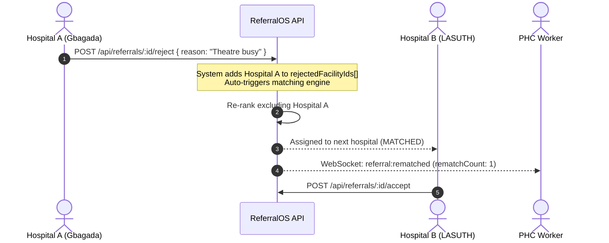

# ReferralOS — Frontend Integration Guide & API Reference

> **Base API URL**: `http://localhost:4000/api` (or `http://localhost:4001/api` if port 4000 is occupied)  
> **Swagger Interactive Docs**: `http://localhost:4000/api/docs`  
> **WebSocket URL**: `http://localhost:4000` (Socket.IO client)

---

## 1. Quick Start & Demo Credentials

The database has been seeded with 9 Lagos healthcare facilities, 5 demo staff accounts, and comprehensive referral scenarios.

| Role | Email (.com or .ng) | Password | Facility Name | Use Case |
| :--- | :--- | :--- | :--- | :--- |
| **PHC Worker** | `amaka@surulere-phc.com` | `demo1234` | Surulere PHC — Aguda | Creating referrals, dispatching transport |
| **PHC Worker** | `chidi@kosofe-phc.com` | `demo1234` | Kosofe PHC — Alapere | Creating referrals, dispatching transport |
| **Hospital Staff** | `fatima@gbagada.com` | `demo1234` | Gbagada General Hospital | Accepting/rejecting, intake, confirming care, feedback |
| **Hospital Staff** | `emeka@lasuth.com` | `demo1234` | LASUTH (Teaching Hospital) | Receiving tertiary referrals, updating ICU/blood |
| **Admin** | `admin@referralos.com` | `demo1234` | Command Centre | Viewing analytics, facility matrix, managing staff |

---

## 2. Authentication & Authorization

ReferralOS uses standard **JWT Bearer Authentication**.

### Client HTTP Header
Include this header in every authenticated request:
```http
Authorization: Bearer <JWT_TOKEN>
```

### Authentication Endpoints

#### 1. Login
```http
POST /api/auth/login
Content-Type: application/json
```
**Request Body:**
```json
{
  "email": "amaka@surulere-phc.ng",
  "password": "demo1234"
}
```
**Response (`200 OK`):**
```json
{
  "token": "eyJhbGciOiJIUzI1NiIsInR5cCI6IkpXVCJ9...",
  "user": {
    "id": "6aadc7a3ce862dbbba2f3764",
    "name": "Amaka Obi",
    "email": "amaka@surulere-phc.ng",
    "role": "PHC_WORKER",
    "facilityId": "6aadc7a1ce862dbbba2f375f"
  }
}
```

#### 2. Get Current User Profile
```http
GET /api/auth/me
Authorization: Bearer <TOKEN>
```
**Response (`200 OK`):**
```json
{
  "id": "6aadc7a3ce862dbbba2f3764",
  "name": "Amaka Obi",
  "email": "amaka@surulere-phc.ng",
  "role": "PHC_WORKER",
  "facilityId": "6aadc7a1ce862dbbba2f375f"
}
```

#### 3. Register a New User
- `PHC_WORKER` registration is **open** (no token required).
- `HOSPITAL_STAFF` and `ADMIN` require an active **Admin Bearer Token** in the header.

```http
POST /api/auth/register
Content-Type: application/json
```
**Request Body:**
```json
{
  "name": "Nurse Grace Okon",
  "email": "grace.okon@surulere-phc.ng",
  "password": "password123",
  "role": "PHC_WORKER",
  "facilityId": "6aadc7a1ce862dbbba2f375f"
}
```

#### 4. List All Users (Admin Only)
```http
GET /api/auth/users
Authorization: Bearer <ADMIN_TOKEN>
```

---

## 3. End-to-End Clinical Workflows

### Flow A: Emergency Referral Happy Path (PHC to Hospital)



---

### Flow B: Rejection & Automated Re-routing Loop

When a hospital is at capacity or lacks emergency resources (e.g. theatre busy), rejecting the referral **automatically** engages the recommendation engine to find and assign the next best facility.



---

## 4. Complete Endpoint Reference & Test Payloads

### 🏥 Facilities

#### 1. List Facilities with Live Indicators
```http
GET /api/facilities
Authorization: Bearer <TOKEN>
```
**Response Sample:**
```json
[
  {
    "id": "6aadc7a1ce862dbbba2f3759",
    "name": "Gbagada General Hospital",
    "tier": "SECONDARY",
    "address": "Hospital Rd, Gbagada, Lagos",
    "lga": "Kosofe",
    "lat": 6.5568,
    "lng": 3.3869,
    "phone": "01-234-5601",
    "capabilities": [
      "OBSTETRIC_EMERGENCY",
      "BLOOD_BANK",
      "THEATRE",
      "NICU"
    ],
    "acceptingStatus": "ACCEPTING",
    "bloodStock": 12,
    "specialistsOnDuty": 3,
    "bedsAvailable": 10,
    "theatreAvailable": true
  }
]
```

#### 2. Update Facility Capacity / Status
Only facility staff or admins can update their own facility.
```http
PATCH /api/facilities/6aadc7a1ce862dbbba2f3759/status
Authorization: Bearer <HOSPITAL_TOKEN>
Content-Type: application/json
```
**Request Body:**
```json
{
  "acceptingStatus": "ACCEPTING",
  "bedsAvailable": 8,
  "bloodStock": 15,
  "specialistsOnDuty": 4,
  "theatreAvailable": true
}
```

---

### 📋 Referrals

#### 1. Create Referral (AI Structuring from Clinical Notes)
```http
POST /api/referrals
Authorization: Bearer <PHC_TOKEN>
Content-Type: application/json
```
**Request Body:**
```json
{
  "rawNotes": "28yr old woman, 36wks pregnant, heavy bleeding since 2hrs, BP 80/50, very weak, needs urgent surgery"
}
```
**Response (`201 Created`):**
```json
{
  "id": "6aadc8062abdb2f61d925de2",
  "refCode": "REF-2026-0007",
  "rawNotes": "28yr old woman, 36wks pregnant, heavy bleeding since 2hrs, BP 80/50, very weak, needs urgent surgery",
  "patientSummary": "28-year-old female, 36 weeks gestation. Antepartum haemorrhage x2 hours with signs of shock.",
  "patientAge": 28,
  "patientGender": "Female",
  "chiefComplaint": "Antepartum haemorrhage",
  "clinicalFindings": "BP 80/50, pallor, heavy vaginal bleeding",
  "urgencyTier": "CRITICAL",
  "urgencyReason": "Severe obstetric haemorrhage with haemodynamic instability",
  "requiredCapability": "OBSTETRIC_EMERGENCY",
  "status": "CREATED",
  "sendingFacilityId": "6aadc7a1ce862dbbba2f375f",
  "rematchCount": 0,
  "createdAt": "2026-09-18T23:23:00.000Z"
}
```

#### 2. Run Matching Engine
Calculates travel distance (Haversine), capability match, accepting status, bed stock, and blood availability. Returns candidates ranked 0–100.
```http
POST /api/referrals/:id/match
Authorization: Bearer <PHC_TOKEN>
```
**Response (`200 OK`):**
```json
{
  "selectedFacilityId": "6aadc7a1ce862dbbba2f3759",
  "candidates": [
    {
      "facilityId": "6aadc7a1ce862dbbba2f3759",
      "facilityName": "Gbagada General Hospital",
      "score": 97,
      "reason": "has required capability, currently accepting, 7.9 km away",
      "distance": 7.9
    },
    {
      "facilityId": "6aadc7a1ce862dbbba2f375a",
      "facilityName": "Lagos Island General Hospital",
      "score": 97,
      "reason": "has required capability, currently accepting, 7.0 km away",
      "distance": 7.0
    },
    {
      "facilityId": "6aadc7a1ce862dbbba2f375c",
      "facilityName": "LASUTH",
      "score": 96,
      "reason": "has required capability, currently accepting, 9.6 km away",
      "distance": 9.6
    }
  ]
}
```

#### 3. List Referrals
```http
GET /api/referrals?status=MATCHED
Authorization: Bearer <TOKEN>
```
*(Admins can also supply `?facilityId=<ID>` to view any specific facility's queue)*

#### 4. Get Single Referral with Full Audit Timeline
```http
GET /api/referrals/:id
Authorization: Bearer <TOKEN>
```
**Response includes:**
- Referral details
- `sendingFacility` and `receivingFacility` objects
- `events`: Array of chronological actions (CREATED, MATCHED, ACCEPTED, etc.)
- `feedback`: Clinical outcome note (when completed)

#### 5. Hospital Accepts Referral
Transitions referral from `MATCHED` to `ACCEPTED`.
```http
POST /api/referrals/:id/accept
Authorization: Bearer <HOSPITAL_TOKEN>
```

#### 6. Hospital Rejects Referral (Triggers Auto-Rematch)
```http
POST /api/referrals/:id/reject
Authorization: Bearer <HOSPITAL_TOKEN>
Content-Type: application/json
```
**Request Body:**
```json
{
  "reason": "Theatre currently in use for emergency C-section"
}
```
**Response (`200 OK`):**
```json
{
  "referral": {
    "id": "...",
    "refCode": "REF-2026-0007",
    "status": "MATCHED",
    "rematchCount": 1,
    "receivingFacilityId": "6aadc7a1ce862dbbba2f375a",
    "rejectionReason": "Theatre currently in use for emergency C-section"
  },
  "rerouted": true,
  "newFacilityId": "6aadc7a1ce862dbbba2f375a",
  "candidates": [ ... ]
}
```

#### 7. Advance Transport & Care Status
Valid transitions:
- `IN_TRANSIT` (Patient departs PHC)
- `ARRIVED` (Ambulance reaches receiving hospital triage)
- `CARE_CONFIRMED` (Patient admitted into ward/theatre)

```http
POST /api/referrals/:id/status
Authorization: Bearer <TOKEN>
Content-Type: application/json
```
**Request Body:**
```json
{
  "status": "IN_TRANSIT",
  "note": "Patient departing with midwife in ambulance LAG-441"
}
```

#### 8. Submit Feedback Note (Closes Loop)
Referral must be in `CARE_CONFIRMED` state. Moves referral to `FEEDBACK_SENT`.
```http
POST /api/referrals/:id/feedback
Authorization: Bearer <HOSPITAL_TOKEN>
Content-Type: application/json
```
**Request Body:**
```json
{
  "diagnosisConfirmed": "Severe Pre-eclampsia in labour",
  "treatmentGiven": "IV Magnesium sulphate loading dose, emergency caesarean section under spinal anaesthesia. Healthy baby delivered, APGAR 8/10.",
  "followUpRequired": true,
  "followUpNote": "PHC BP check on day 3 post-discharge.",
  "outcomeStatus": "Mother and baby stable"
}
```

---

### 📊 Analytics & Command Centre

#### 1. System Summary & AI Insight
```http
GET /api/analytics/summary
Authorization: Bearer <TOKEN>
```
**Response Sample:**
```json
{
  "totalReferrals": 11,
  "completionRate": 36.4,
  "avgAcceptanceMinutes": 12.0,
  "criticalCount": 4,
  "topRejectionReason": "Theatre unavailable",
  "byStatus": {
    "CREATED": 1,
    "MATCHED": 2,
    "ACCEPTED": 1,
    "IN_TRANSIT": 1,
    "ARRIVED": 1,
    "CARE_CONFIRMED": 1,
    "FEEDBACK_SENT": 4
  },
  "insight": "Referral completion rate is 36% — below the 70% target. The most common rejection reason is 'Theatre unavailable'. Consider reallocating surgical teams during peak evening hours."
}
```

#### 2. Live Command Centre Active Referrals
Returns all currently open referrals (excluding terminal `FEEDBACK_SENT` and `REJECTED`).
```http
GET /api/analytics/active
Authorization: Bearer <ADMIN_OR_TOKEN>
```

#### 3. Facility Capacity Matrix
Returns real-time capacity and live referral volume for every facility in the network.
```http
GET /api/analytics/facilities
Authorization: Bearer <ADMIN_OR_TOKEN>
```

#### 4. Historical Timeline Activity
```http
GET /api/analytics/timeline?days=30
Authorization: Bearer <ADMIN_OR_TOKEN>
```

---

## 5. Real-Time WebSockets (Socket.IO Client)

ReferralOS features real-time push updates. All connected clients automatically join their facility's room: `facility:<facilityId>`. Admins additionally join the `admin` room.

### Connection Example (React / Vue / Vanilla JS)

```javascript
import { io } from "socket.io-client";

const socket = io("http://localhost:4000", {
  auth: {
    token: userJwtToken, // Pass token during handshake
  },
  transports: ["websocket"],
});

socket.on("connect", () => {
  console.log("Connected to ReferralOS WebSocket! Socket ID:", socket.id);
});

// 1. When a new referral is matched to this facility
socket.on("referral:matched", (referral) => {
  console.log("🔔 Incoming referral:", referral.refCode, referral.patientSummary);
});

// 2. When hospital accepts
socket.on("referral:accepted", (referral) => {
  console.log("✅ Referral accepted:", referral.refCode);
});

// 3. When hospital rejects and auto-reroute triggers
socket.on("referral:rematched", ({ referral, newFacilityId }) => {
  console.log("⚠️ Referral auto-rerouted to new facility:", newFacilityId);
});

// 4. Status transitions (IN_TRANSIT, ARRIVED, CARE_CONFIRMED)
socket.on("referral:status_changed", (referral) => {
  console.log("🔄 Referral status update:", referral.refCode, "→", referral.status);
});

// 5. Final feedback note
socket.on("referral:feedback_sent", (referral) => {
  console.log("📄 Clinical feedback received for:", referral.refCode);
});

// 6. Live bed & blood capacity change
socket.on("facility:status_updated", (facility) => {
  console.log("🏥 Facility status change:", facility.name, "Beds:", facility.bedsAvailable);
});
```

---

## 6. TypeScript Data Models (Copy & Paste for Frontend)

```typescript
export type UserRole = "PHC_WORKER" | "HOSPITAL_STAFF" | "ADMIN";

export type FacilityTier = "PHC" | "SECONDARY" | "TERTIARY";

export type AcceptingStatus = "ACCEPTING" | "LIMITED" | "UNAVAILABLE";

export type Capability =
  | "OBSTETRIC_EMERGENCY"
  | "BLOOD_BANK"
  | "THEATRE"
  | "NICU"
  | "ICU"
  | "DIALYSIS"
  | "TRAUMA"
  | "PAEDIATRICS";

export type UrgencyTier = "CRITICAL" | "HIGH" | "MEDIUM" | "LOW";

export type ReferralStatus =
  | "CREATED"
  | "MATCHED"
  | "ACCEPTED"
  | "IN_TRANSIT"
  | "ARRIVED"
  | "CARE_CONFIRMED"
  | "FEEDBACK_SENT"
  | "REJECTED";

export interface User {
  id: string;
  name: string;
  email: string;
  role: UserRole;
  facilityId: string;
}

export interface Facility {
  id: string;
  name: string;
  tier: FacilityTier;
  address: string;
  lga: string;
  lat: number;
  lng: number;
  phone: string;
  capabilities: Capability[];
  acceptingStatus: AcceptingStatus;
  bloodStock: number;
  specialistsOnDuty: number;
  bedsAvailable: number;
  theatreAvailable: boolean;
}

export interface ReferralEvent {
  id: string;
  referralId: string;
  eventType: string;
  actorId?: string | null;
  note?: string | null;
  timestamp: string;
}

export interface FeedbackNote {
  id: string;
  referralId: string;
  diagnosisConfirmed: string;
  treatmentGiven: string;
  followUpRequired: boolean;
  followUpNote?: string | null;
  outcomeStatus?: string | null;
  sentAt: string;
}

export interface MatchCandidate {
  facilityId: string;
  facilityName: string;
  score: number; // 0 to 100
  reason: string;
  distance: number; // in km
}

export interface Referral {
  id: string;
  refCode: string;
  rawNotes: string;
  patientSummary?: string | null;
  patientAge?: number | null;
  patientGender?: string | null;
  chiefComplaint?: string | null;
  clinicalFindings?: string | null;
  urgencyTier: UrgencyTier;
  urgencyReason?: string | null;
  requiredCapability: Capability;
  status: ReferralStatus;
  sendingFacilityId: string;
  receivingFacilityId?: string | null;
  matchCandidates?: MatchCandidate[] | null;
  rejectionReason?: string | null;
  rematchCount: number;
  createdAt: string;
  updatedAt: string;
  sendingFacility?: Facility;
  receivingFacility?: Facility | null;
  events?: ReferralEvent[];
  feedback?: FeedbackNote | null;
}
```
